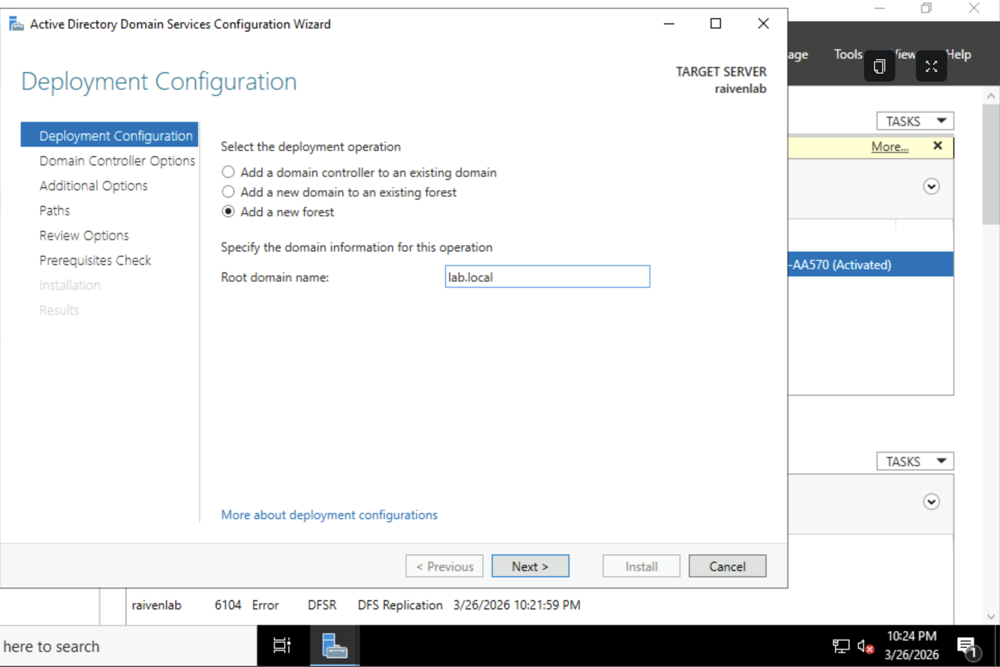

<h1>Active Directory Home Lab in Azure</h1>

<h2>Description</h2>
<h3>What I Did:</h3>
<li>
  <ol>Built a cloud-based Windows Server 2022 home lab in <strong>Microsoft Azure</strong></ol> 
  <ol>Created a Resource Group in Azure to organize all lab resources.</ol>
   <ol>Deployed a Windows Server 2022 VM using Azure’s virtual machine service.</ol>
   <ol>I promoted the server to a Domain Controller</ol>
   </img>
   <h4>Promoting the domain controller with the domain name lab.local </h4>
  </img>
  <h4> Deploying my VM with the resource group I created </h4>
  
 
  <ol>I configured networking and enabled Remote Desktop Protocol (RDP) for remote access.</ol>
  <ol></ol>

  </img>
  <h4>The completed Server Manager setup</h4>
</li>

